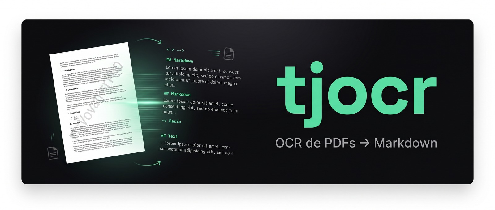

<p align="center">
  
</p>

<h1 align="center">tjocr</h1>

<p align="center">
  <strong>OCR de PDFs direto no terminal.</strong> Recebe um <strong>PDF</strong> e devolve <strong>Markdown</strong>,
  via a API de OCR da TecJustiça.<br>
  Binário único, <strong>sem dependências</strong> — não precisa de Python, Node, Go ou curl instalados.
</p>

<p align="center">
  <a href="https://github.com/marcosmarf27/tjocr/releases/latest"></a>
  <a href="#instalação"></a>
  <a href="https://github.com/marcosmarf27/tjocr/releases"></a>
  
</p>

```bash
tjocr documento.pdf -o documento.md      # 1 PDF  → Markdown
tjocr *.pdf -d ./md/                      # lote   → vários .md em paralelo
```

---

## Índice

- [O que é](#o-que-é)
- [Instalação rápida (1 comando)](#instalação-rápida-1-comando)
- [Download](#download)
- [Instalação](#instalação)
- [Configuração da chave](#configuração-da-chave)
- [Uso](#uso)
- [Lote: vários PDFs em paralelo](#lote-vários-pdfs-em-paralelo)
- [Correção por IA (`--enhance`)](#correção-por-ia---enhance)
- [Documentos grandes e cancelamento](#documentos-grandes-e-cancelamento)
- [Como funciona](#como-funciona)
- [Como skill do Claude Code](#como-skill-do-claude-code)
- [Suporte](#suporte)

---

## O que é

`tjocr` extrai o texto de PDFs — **inclusive escaneados** — e entrega Markdown estruturado, o
mesmo resultado do dashboard da TecJustiça, mas pela linha de comando: sem login, sem upload
manual, scriptável e encadeável em pipelines.

> **O motor de OCR é fixo e não se configura.** O servidor roda **PaddleOCR em GPU** (o melhor
> disponível para PT-BR) com **OCR seletivo**: cada página é analisada e só as escaneadas passam
> pelo OCR — as digitais são lidas direto. A **única** opção de qualidade é o `--enhance`
> (correção por IA, desligada por padrão). As demais flags só ajustam resolução, páginas, idioma
> e destino da saída.

Pensado para alimentar a etapa seguinte (ex.: a CLI [`tj-mapa`](https://github.com/marcosmarf27/tj-mapa-cli), que gera o mapa do processo):

```bash
tjocr processo.pdf -o processo.md     # PDF → Markdown (OCR)
tj-mapa processo.md                   # Markdown → mapa navegável do processo
```

---

## Instalação rápida (1 comando)

Um único comando **baixa o binário certo, instala no PATH e pede sua chave** — deixando o `tjocr`
pronto para usar. Rodar de novo apenas **atualiza** para a última versão.

**Linux / WSL**

```bash
curl -fsSL https://raw.githubusercontent.com/marcosmarf27/tjocr/main/install.sh | bash
```

**Windows (PowerShell)**

```powershell
irm https://raw.githubusercontent.com/marcosmarf27/tjocr/main/install.ps1 | iex
```

> **Já tem a chave em mãos?** Passe-a junto e o instalador nem pergunta:
>
> ```bash
> # Linux / WSL
> curl -fsSL https://raw.githubusercontent.com/marcosmarf27/tjocr/main/install.sh | TJOCR_API_KEY=tjp_xxx bash
> ```
> ```powershell
> # Windows
> $env:TJOCR_API_KEY="tjp_xxx"; irm https://raw.githubusercontent.com/marcosmarf27/tjocr/main/install.ps1 | iex
> ```

O que o instalador faz: detecta seu SO, baixa o executável da última release, instala no PATH do
usuário (`~/.local/bin` no Linux/WSL · `%LOCALAPPDATA%\Programs\tjocr` no Windows), e salva a chave
no config. Sem `sudo`/admin, sem dependências. Prefere fazer na mão? Veja [Download](#download).

---

## Download

Baixe o executável do seu sistema na **[última release](https://github.com/marcosmarf27/tjocr/releases/latest)**:

| Sistema | Arquivo |
|---------|---------|
| 🪟 **Windows** (10/11, 64-bit) | `tjocr_windows_amd64.exe` |
| 🐧 **Linux / WSL** (64-bit) | `tjocr_linux_amd64` |

O binário é **estático e autossuficiente** — basta copiá-lo para a máquina e rodar. Nada de
runtime, instalador ou bibliotecas externas.

> Usa o Claude Code / Claude Desktop? Há também uma **skill** pronta — veja
> [Como skill do Claude Code](#como-skill-do-claude-code).

---

## Instalação

O `tjocr` já funciona ao ser executado pelo caminho onde está. O subcomando `install` (opcional)
copia o binário para uma pasta no **PATH do usuário**, para você poder chamar `tjocr` de qualquer
lugar — sem `sudo`/admin e sem mexer no sistema todo.

### Windows

1. Baixe `tjocr_windows_amd64.exe`.
2. Abra o **PowerShell na pasta do download** e rode:

   ```powershell
   .\tjocr_windows_amd64.exe install
   ```

   Isso copia o programa para `%LOCALAPPDATA%\Programs\tjocr\` e adiciona a pasta ao seu PATH de
   usuário. **Reabra o terminal** depois — o PATH novo só vale em janelas abertas a seguir.

### Linux / WSL

```bash
chmod +x tjocr_linux_amd64
./tjocr_linux_amd64 install        # copia para ~/.local/bin/tjocr
```

Se `~/.local/bin` ainda não estiver no seu PATH, o próprio comando avisa como adicionar:

```bash
export PATH="$HOME/.local/bin:$PATH"   # adicione ao seu ~/.bashrc (ou ~/.zshrc)
```

> O `install` é **idempotente**: rodar de novo apenas atualiza o binário, sem duplicar o PATH.

---

## Configuração da chave

Você precisa de uma **API key** da TecJustiça (obtida no
[dashboard](https://tecjustica-dashboard-production.up.railway.app)). Configure **uma vez por
máquina**:

```bash
tjocr config set        # cole a chave e tecle Enter (não fica no histórico do shell)
tjocr config show       # confere: mostra a chave mascarada, a base URL e o caminho do config
```

### Subcomandos de `config`

| Comando | O que faz |
|---------|-----------|
| `config set` | Lê a chave do **teclado/stdin** — **não** fica no histórico. Aceita pipe: `echo "$KEY" \| tjocr config set`. **Recomendado.** |
| `config set-key KEY` | Salva a chave passada como argumento — **fica no histórico** do shell; prefira `set`. |
| `config set-url URL` | Aponta para outra base URL da API (raro; o padrão é a produção). |
| `config show` | Mostra a chave (mascarada), a base URL e o caminho do arquivo de config. |

### Onde a chave fica salva

| Sistema | Caminho do config |
|---------|-------------------|
| Linux / WSL / macOS | `~/.config/tjocr/config.json` |
| Windows | `%AppData%\tjocr\config.json` |

O arquivo é criado com **permissão restrita** (`0600` — só o seu usuário lê).

### Variáveis de ambiente e precedência

A chave pode vir de várias fontes. O `tjocr` usa a **primeira** que encontrar, nesta ordem:

```
1. --key KEY              (flag na linha de comando)
2. env TJOCR_API_KEY      (variável de ambiente própria)
3. config salvo           (tjocr config set)
4. envs legadas           (compatibilidade — ver abaixo)
```

As **envs legadas** existem para **não quebrar scripts** que já exportam a chave com outro nome
(ou que a compartilham com outro serviço da TecJustiça). São consultadas nesta ordem, só depois do
config salvo:

```
TECJUSTICA_API_KEY  →  TECJUSTICA_PARSE_API_KEY  →  TECJUSTICA_OCR_API_KEY  →  TECJUSTICA_OCR_KEY
```

> **Por que uma env própria `TJOCR_API_KEY`?** Para **não colidir** com as legadas (`TECJUSTICA_*`),
> que podem já estar definidas para **outro serviço** no seu ambiente. Por isso a `TJOCR_API_KEY` e
> o config salvo têm prioridade sobre qualquer uma das legadas.

| Variável | Uso |
|----------|-----|
| `TJOCR_API_KEY` | **Recomendada.** Sobrepõe o config salvo; ideal para CI/scripts. |
| `TECJUSTICA_API_KEY` | Legado. Aceita por compatibilidade. |
| `TECJUSTICA_PARSE_API_KEY` | Legado. Aceita por compatibilidade. |
| `TECJUSTICA_OCR_API_KEY` | Legado. Aceita por compatibilidade. |
| `TECJUSTICA_OCR_KEY` | Legado. Aceita por compatibilidade. |

Exemplos:

```bash
export TJOCR_API_KEY="tjp_xxx"          # passa a valer para toda a sessão
tjocr doc.pdf --key tjp_yyy -o out.md   # chave avulsa só para este comando
```

---

## Uso

```bash
tjocr <arquivo.pdf> [opções]               # 1 PDF  → Markdown (stdout ou -o)
tjocr <a.pdf> <b.pdf> ... [opções]         # LOTE   → vários PDFs em paralelo (ver abaixo)
```

### Opções

| Opção | Padrão | Descrição |
|-------|--------|-----------|
| `-o, --output FILE` | stdout | Salva o Markdown em arquivo (**só com 1 PDF**). Sem isso, vai pro stdout — ideal pra pipe. |
| `-d, --outdir DIR` | ao lado do PDF | Pasta de saída dos `.md` (vale no lote **e** com 1 PDF). |
| `--parallel N` | `3` | PDFs processados em paralelo no lote (1–8). |
| `--dpi N` | `150` | Resolução do OCR: `72` (rápido) · `150` (padrão) · `300` (máximo). |
| `--enhance` | off | **Única opção de qualidade:** corrige o OCR com IA (Gemini Vision). Mais lento (~7–11 s/pg) e pode **reescrever** trechos — [veja abaixo](#correção-por-ia---enhance). |
| `--pages RANGE` | (todas) | Só algumas páginas, ex.: `1-5,10,15-20`. |
| `--lang CODE` | `pt` | Idioma do OCR (ISO 639-1). |
| `--key KEY` | — | API key avulsa, sobrepõe env/config para este comando. |
| `--quiet` | off | Não mostra o progresso/resumo no stderr. |

As flags funcionam em **qualquer posição** (`tjocr doc.pdf -o out.md` ≡ `tjocr -o out.md doc.pdf`).
O **Markdown** sai no `-o` (ou no stdout); o **progresso e o resumo** saem no **stderr** — então dá
para usar em pipe sem sujar a saída.

> **Não existe opção de motor de OCR.** É sempre o PaddleOCR GPU do servidor, com OCR seletivo
> automático. A flag `--engine` de versões antigas segue **aceita e ignorada** (compat com scripts).

### Exemplos

```bash
tjocr processo.pdf -o processo.md                     # salva em arquivo
tjocr matricula.pdf --enhance --pages 1-3 -o saida.md # correção por IA só nas páginas 1–3
tjocr doc.pdf | grep "CPF"                             # Markdown direto no pipe
tjocr doc.pdf --dpi 300 -o nitido.md                  # resolução máxima
```

---

## Lote: vários PDFs em paralelo

Passe **vários PDFs** (ou um glob) e o `tjocr` processa **`--parallel` por vez** (padrão 3, máx 8).
Cada PDF vira um `.md` de mesmo nome, na pasta `-d/--outdir` (ou ao lado do PDF original):

```bash
tjocr autos1.pdf autos2.pdf autos3.pdf -d ./md/
tjocr *.pdf -d ./md/ --parallel 4       # glob funciona até no Windows (expansão própria)
```

- **Progresso por arquivo** no stderr: `✓ [2/5] autos2.pdf (processado) | 80 pgs … → ./md/autos2.md`
- **Ctrl+C cancela TODOS os jobs em andamento** no servidor (estorna os pontos reservados).
- **Exit code `1`** se qualquer PDF falhar (os demais continuam e são salvos normalmente).
- `-o` **não** vale no lote (cada PDF tem a própria saída) — use `-d`.
- PDFs de mesmo nome que cairiam no mesmo `.md` são detectados **antes** de processar, com erro
  claro — nada é sobrescrito silenciosamente.

---

## Correção por IA (`--enhance`)

O OCR já roda **automaticamente** — não há flag para ligá-lo: a API decide, página a página, o que
é escaneado (vai pro OCR) e o que já é texto digital (lê direto). O `--enhance` é um passo
**opcional** _em cima_ disso.

Com `--enhance`, cada página que passou por OCR é revisada por uma **IA de visão (Gemini)**: ela
compara a imagem da página com o texto do OCR e **corrige** erros típicos — datas, CPF/CNPJ,
valores, nomes, números de registro — além de **remover** ruído de layout (marca d'água, selo
digital, QR de validação, rodapé de cartório).

```bash
tjocr matricula.pdf --enhance -o matricula.md            # liga o enhance
tjocr matricula.pdf --enhance --pages 1-3 -o saida.md    # só nas páginas 1–3
```

- **Padrão: desligado.** Ligue só quando precisar — é mais lento (~7–11 s por página com OCR) e tem
  custo maior.
- **Use** em documentos degradados (datilografados antigos, matrículas, scans ruins) onde a
  fidelidade de números/nomes importa.
- **Cuidado:** é reconstrução por IA — pode **reescrever** um trecho. Revise os dados críticos
  sempre que ligar. Em páginas **genuinamente ilegíveis** ele mantém o **OCR cru** em vez de deixar
  a IA inventar texto plausível em cima do ruído (e te avisa — veja a tabela).

### Status do enhance (sem fallback silencioso)

A IA nem sempre consegue atuar (sem saldo no Gemini, página ilegível, etc.). O `tjocr` **não
esconde** isso — ao final, no stderr, ele diz exatamente o que foi corrigido:

| Mensagem (no stderr) | Significado |
|----------------------|-------------|
| `✓ Enhance IA: N/N páginas corrigidas` | A IA revisou **todas** as páginas de OCR. |
| `⚠ Enhance IA parcial: X/N páginas corrigidas` | Em algumas páginas a IA não atuou; **essas voltaram com o OCR cru**. |
| `⚠ Enhance IA NÃO atuou (0/N) — devolvendo OCR CRU` | Nada foi corrigido; o texto é o OCR puro. Vem com o **motivo** (ex.: créditos do Gemini esgotados, página ilegível). |
| `ℹ Enhance: nenhuma página de OCR para corrigir` | O documento já era texto digital — não houve OCR a melhorar. |

Assim você **nunca paga nem espera por uma correção que não aconteceu** sem saber.

---

## Documentos grandes e cancelamento

- **Documentos grandes** (centenas de páginas, até **1 GB**): o servidor processa o OCR em blocos
  automaticamente — nada a configurar. O `tjocr` escala o tempo de upload com o tamanho do PDF e
  aguarda o processamento por até **90 minutos**. Quedas momentâneas de rede durante a espera **não**
  derrubam o job: ele continua no servidor e o `tjocr` reconecta.
- **Ctrl+C cancela de verdade:** interromper o `tjocr` durante o processamento envia um
  cancelamento ao servidor — o OCR é derrubado e o **ponto reservado é estornado**.

```text
^C
cancelando o job 78c1788d-… no servidor (estorna o ponto)…
✓ job cancelado; ponto reservado estornado.
```

---

## Como funciona

1. Envia o PDF para a API de OCR (`POST /parse/async`, multipart), tratando o **303 de cold start**.
2. A resposta segue um de dois caminhos:
   - **cache hit** (PDF já processado antes) → o Markdown volta **na hora**;
   - **assíncrono** → volta um `job_id`, e o `tjocr` faz **polling** do status (respeitando o rate
     limit) até concluir.
3. Entrega o **Markdown** — uma seção `## Página N` por página.

O OCR é **seletivo**: páginas digitais são lidas direto (rápido e barato) e só as escaneadas vão
para o PaddleOCR GPU. Documentos já processados antes voltam **instantâneos** (cache). O cache é por
**(conteúdo do PDF + parâmetros)** — mudar `--dpi`/`--pages`/`--enhance` reprocessa.

---

## Como skill do Claude Code

Se você usa o **Claude Code** ou o **Claude Desktop**, a release traz a CLI empacotada como
**skill** (com os binários Windows + Linux/WSL embutidos — não precisa instalar nada à parte):

| Arquivo na release | Para que serve |
|--------------------|----------------|
| `tjocr.skill` | Instalação direta da skill no Claude Code/Desktop. |
| `tjocr-skill.zip` | Mesmo conteúdo em `.zip` (para inspecionar/instalar manualmente). |

Com a skill instalada, basta pedir em linguagem natural para extrair o texto de um PDF — ela detecta
o seu sistema, executa o binário certo e cuida da configuração da chave.

---

## Suporte

Dúvidas, bugs ou sugestões? Abra uma **[issue](https://github.com/marcosmarf27/tjocr/issues)**.

<p align="center"><sub>Feito pela <strong>TecJustiça</strong> · OCR de PDFs jurídicos em PT-BR</sub></p>
